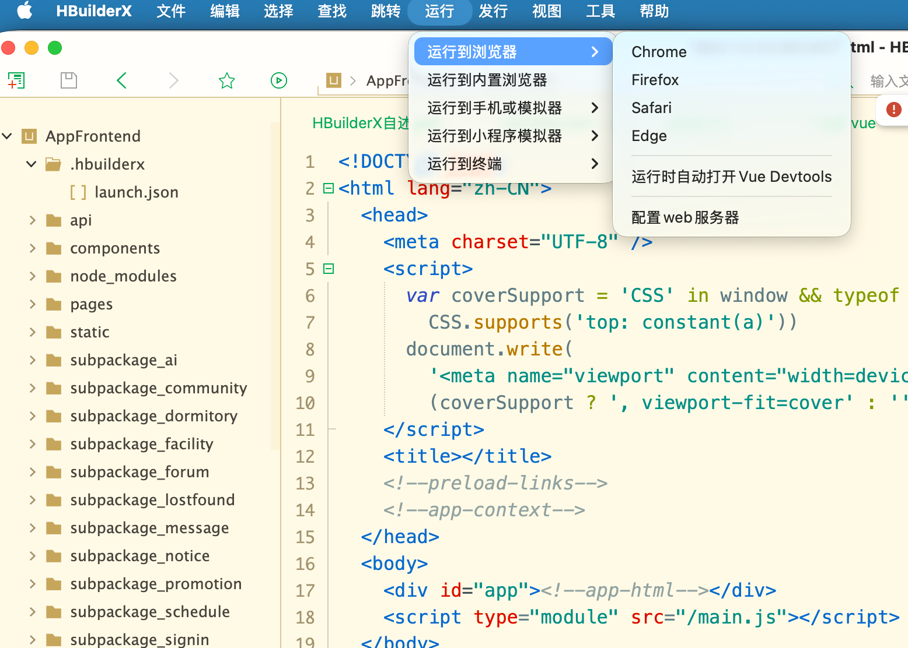

# 智慧校园

智慧校园是一个面向校园生活服务场景的前后端分离项目，包含 uni-app 移动端、React 管理后台和 Spring Boot 后端服务。系统围绕校园用户的日常使用路径，提供首页信息聚合、校园地图、通知公告、课程表、成绩查询、论坛社区、活动报名、失物招领、宿舍服务、餐饮商户、优惠活动、运动场馆、消息中心和 AI 创作等功能。

项目采用一套后端接口同时支撑移动端 App 和 Web 管理后台，后端负责用户认证、业务数据管理、地图服务、文件上传、AI 创作、统计分析等能力。

## 智能体学习资源生成能力

项目的 AI 创作模块面向个性化学习资源生成场景，目标是让学生通过自然语言描述自己的专业背景、学习基础、课程内容和学习目标后，系统自动完成学习画像构建、课程知识检索、学习任务规划、资源生成和内容审核，最终形成一份结构完整的个性化学习资源包。

第一期重点实现“多智能体协同生成学习资源”的核心闭环。系统接收学生输入后，由总控调度智能体识别用户意图并拆分任务，再依次调用学习画像分析、课程知识库检索、学习任务规划、课程讲解文档生成、思维导图生成、练习题生成、实操案例生成、拓展阅读生成、内容审核与资源整合等智能体，最终将多类学习材料统一整理后返回给前端展示。

### 第一阶段核心流程

```text
用户输入学习需求
        ↓
总控调度智能体
        ↓
学习画像分析智能体
        ↓
课程知识库检索智能体
        ↓
学习任务规划智能体
        ↓
课程讲解文档生成智能体
        ↓
知识点思维导图生成智能体
        ↓
练习题生成智能体
        ↓
实操案例生成智能体
        ↓
拓展阅读生成智能体
        ↓
内容审核与资源整合智能体
        ↓
生成个性化学习资源包
```

### 第一期智能体划分

| 序号 | 智能体名称 | 第一阶段定位 |
| --- | --- | --- |
| 1 | 总控调度智能体 | 理解用户任务，识别意图，拆分任务并调度其他智能体 |
| 2 | 学习画像分析智能体 | 从对话中提取专业、年级、课程、基础、目标、偏好、薄弱点和学习进度 |
| 3 | 课程知识库检索智能体 | 根据课程和薄弱知识点检索章节、知识点和参考资料 |
| 4 | 学习任务规划智能体 | 判断当前应生成哪些资源，并确定难度、风格和学习顺序 |
| 5 | 课程讲解文档生成智能体 | 生成 Markdown 课程讲解文档、示例代码、常见错误和学习小结 |
| 6 | 知识点思维导图生成智能体 | 生成树状知识结构和 Mermaid 思维导图 |
| 7 | 练习题生成智能体 | 生成选择题、简答题、编程题、参考答案和解析 |
| 8 | 实操案例生成智能体 | 生成可运行代码案例、实验任务、运行示例和拓展任务 |
| 9 | 拓展阅读生成智能体 | 根据学习目标推荐拓展主题、学习方向和使用建议 |
| 10 | 内容审核与资源整合智能体 | 检查内容准确性、代码完整性和格式一致性，并整合为资源包 |

### 资源包输出内容

系统最终输出的学习资源包包含：

- 学习画像摘要
- 匹配课程章节和知识点
- 学习任务规划
- 课程讲解文档
- 知识点思维导图
- 个性化练习题
- 代码实操案例
- 拓展阅读建议
- 内容审核结果

### 示例场景

用户输入：

```text
我是计算机专业大二学生，Python 基础一般，正在学习函数和文件操作，希望系统帮我生成适合我的学习资料，最好有代码案例和练习题。
```

系统会自动提取学生画像，检索 Python 函数与文件操作相关知识点，规划学习资源类型，并生成课程讲解、思维导图、练习题、代码案例和拓展阅读，最后通过内容审核智能体统一整理成个性化学习资源包。

## 项目截图

> 截图可以放到 `docs/images/` 目录，然后替换下面的图片路径。

### 移动端首页


### 校园地图


### AI 创作


### Web 管理后台


### App 启动方式



## 功能模块

### 移动端 App

- 首页：校园服务入口、轮播信息、快捷功能聚合。
- 校园地图：地点标记、附近设施、路线导航、位置检索。
- 通知公告：公告列表、公告详情、消息提醒。
- 课程与成绩：课程表、课程详情、成绩查询。
- 社区论坛：话题、帖子、评论、点赞、关注、个人主页。
- 校园活动：活动列表、活动详情、报名记录、我的活动。
- 失物招领：物品发布、详情查看、聊天沟通、我的发布。
- 宿舍服务：宿舍列表、宿舍选择、宿舍详情。
- 餐饮与商户：餐厅、档口、菜品、评价。
- 优惠活动：优惠列表、搜索、详情、领取。
- 运动场馆：场馆列表、场馆详情。
- AI 功能：智能写作、AI 创作、对话记忆。
- 个人中心：登录注册、资料维护、密码修改。

### Web 管理后台

- 后台登录与权限入口。
- 用户管理。
- 首页数据看板和统计分析。
- 公告、活动、商户、菜品、设施、地图点位等业务数据维护。
- 系统配置、上传配置、AI 配置等管理能力。

### 后端服务

- Spring Boot REST API。
- JWT 登录认证。
- MySQL 数据持久化。
- 文件上传与本地资源管理。
- 地图定位、地点标记与路线相关接口。
- AI 写作与创作能力。
- Swagger 接口文档。

## 技术栈

| 模块 | 技术 |
| --- | --- |
| 移动端 App | uni-app |
| Web 管理后台 | React 19、Vite、Ant Design、ECharts、Axios |
| 后端服务 | Spring Boot 4、Spring Web MVC、Spring Data JPA |
| 数据库 | MySQL |
| 接口文档 | Springdoc OpenAPI / Swagger UI |
| 地图服务 | 校园地点标记、导航与位置服务 |
| 文件存储 | 本地上传 |
| AI 能力 | 智能写作、AI 创作 |

## 项目结构

```text
smart-campus/
├── AppBackend/          # Spring Boot 后端服务
│   └── src/main/
│       ├── java/com/example/appbackend/
│       │   ├── config/      # 配置类
│       │   ├── controller/  # 控制层接口
│       │   ├── dto/         # 数据传输对象
│       │   ├── entity/      # JPA 实体
│       │   ├── graph/       # AI 对话状态
│       │   ├── repository/  # 数据访问层
│       │   ├── scheduler/   # 定时任务
│       │   ├── service/     # 业务层
│       │   └── util/        # 工具类
│       └── resources/
│           ├── application.yml
│           └── data.sql
├── AppFrontend/         # uni-app 移动端
│   ├── pages/           # 主包页面
│   ├── subpackage_*/    # 分包页面
│   ├── api/             # 接口封装
│   ├── components/      # 公共组件
│   ├── static/          # 静态资源
│   └── utils/           # 工具与配置
├── AppWeb/              # React Web 管理后台
│   ├── src/
│   │   ├── api/         # 后台接口
│   │   ├── components/  # 公共组件
│   │   ├── pages/       # 页面
│   │   └── utils/       # 请求与存储工具
│   └── vite.config.js
└── README.md
```

## 环境要求

- JDK 21
- Maven 3.9+
- Node.js 20+
- MySQL 8+
- HBuilderX 或 uni-app 运行环境

## 数据库创建

本项目使用 MySQL，数据库名称为：

```text
smart-campus
```

先启动 MySQL，然后执行：

```sql
CREATE DATABASE `smart-campus` DEFAULT CHARACTER SET utf8mb4 COLLATE utf8mb4_unicode_ci;
```

如果需要手动选择数据库：

```sql
USE `smart-campus`;
```

后端启动时会根据 JPA 实体自动创建或更新表结构，并执行 `AppBackend/src/main/resources/data.sql` 初始化基础数据。

后端默认连接配置位于 `AppBackend/src/main/resources/application.yml`：

```yaml
spring:
  datasource:
    url: jdbc:mysql://localhost:3306/smart-campus?useUnicode=true&characterEncoding=utf8&serverTimezone=Asia/Shanghai
    username: root
    password: 123456
```

如本地数据库账号不同，请修改为自己的 MySQL 用户名和密码。

## 启动后端服务

后端目录为 `AppBackend/`，是一个 Spring Boot + Maven 项目。

```bash
cd AppBackend
mvn spring-boot:run
```

启动成功后，后端服务地址为：

```text
http://localhost:8080
```

Swagger 接口文档地址：

```text
http://localhost:8080/swagger-ui.html
```

## 启动 Web 管理后台

Web 管理后台目录为 `AppWeb/`，是一个 React + Vite 项目。

```bash
cd AppWeb
npm install
npm run dev
```

默认访问地址：

```text
http://localhost:5174
```

构建生产包：

```bash
npm run build
```

本地预览生产包：

```bash
npm run preview
```

### Web 管理后台创建方式

如果需要从零创建同类型 Web 项目，可以执行：

```bash
npm create vite@latest AppWeb -- --template react
cd AppWeb
npm install
npm install antd axios dayjs echarts react-router-dom
npm run dev
```

当前项目固定使用 Vite 端口 `5174`，配置在 `AppWeb/package.json`：

```json
{
  "scripts": {
    "dev": "vite --port 5174"
  }
}
```

## 启动移动端 App

移动端位于 `AppFrontend/`，推荐使用 HBuilderX 打开并运行。

1. 使用 HBuilderX 打开 `AppFrontend/`。
2. 确认后端服务已启动。
3. 检查 `AppFrontend/utils/config.js` 中的接口地址是否指向本机后端。
4. 选择运行到浏览器、微信小程序模拟器或手机设备。


## 常用访问地址

| 服务 | 地址 |
| --- | --- |
| 后端 API | http://localhost:8080 |
| Swagger 文档 | http://localhost:8080/swagger-ui.html |
| Web 管理后台 | http://localhost:5174 |
| MySQL 数据库 | localhost:3306/smart-campus |
