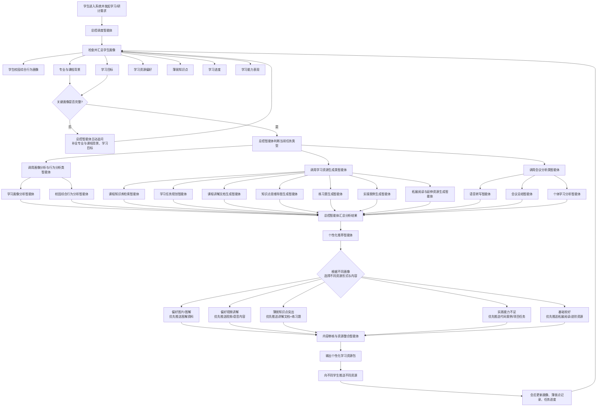

# 智慧校园

> 署名说明：
> 1. 本文档中的“基本功能需求”与“非功能性需求”为赛事官方要求整理，署名为官方要求。
> 2. “AI 学习研讨分析与个性化资源推送”特色功能方案由张泽升提出，已纳入本项目特色能力设计。

智慧校园是一个面向校园学习与生活服务场景的前后端分离项目，包含 `uni-app` 移动端、`React` Web 管理后台和 `Spring Boot` 后端服务。系统围绕校园用户的日常使用路径，提供首页信息聚合、校园地图、通知公告、课程与成绩、论坛社区、活动报名、失物招领、宿舍服务、餐饮商户、优惠活动、运动场馆、消息中心和 AI 学习支持等能力。

项目采用一套后端接口同时服务移动端 App 和 Web 管理后台。后端负责用户认证、业务数据管理、地图服务、文件上传、AI 内容生成、学习过程分析与统计等核心能力。

## 核心特色

### 官方要求说明

#### 基本功能需求

1. 对话式学习画像自主构建  
   支持通过自然语言对话，结合学生专业、学习目标、学习历史等信息自动抽取特征，构建不少于 6 个维度的动态学生画像，并支持随学习过程持续更新。

2. 多智能体协同的资源生成  
   系统需体现多智能体架构设计，通过智能交互和大模型能力，围绕专业、课程内容、知识短板和学习需求生成多模态学习资料，并由不同角色智能体协作完成至少 5 种类型的个性化资源生成，如课程讲解文档、思维导图、练习题、拓展阅读、教学视频或动画、代码实操案例等。

3. 个性化学习路径规划和资源推送  
   依托多智能体协同机制，整合个性化资源，结合学生专业、学习进度、知识掌握情况和学习偏好进行深度分析，为学生规划科学、动态的学习路径，并基于画像进行精准资源推送。

4. 智能辅导（可选加分项）  
   当学生学习过程中遇到问题时，系统可提供即时、多模态答疑服务，结合数据分析、大模型知识能力和多模态生成技术，输出文字解答、图解说明、短视频讲解等形式的学习引导。

5. 学习效果评估（可选加分项）  
   系统可跟踪学生学习行为、练习测试情况和资源使用反馈，依托大模型分析能力实现多维度学习效果评估，并根据结果动态调整资源推送策略和学习计划。

#### 非功能性需求

1. 系统界面应美观大方、简洁明了，交互逻辑清晰，符合现代 AI 产品交互规范，如流式输出、Markdown 渲染和多模态内容卡片化展示。

2. 若开发过程中使用开源项目或前沿 AI 工具、框架，需在提交文档显著位置标注名称、来源及相关协议要求。

3. 系统需具备完善的防幻觉与内容安全过滤机制，确保生成内容无明显事实性错误、无敏感违规信息。

4. 智能体核心功能响应时间需控制在合理范围内，多模态资源生成需满足实际学习场景需求，并建议提供生成进度追踪或流式呈现机制。

### AI 个性化学习资源生成

系统支持学生通过自然语言描述自己的专业背景、学习基础、课程内容和学习目标，由 AI 自动完成学习画像构建、课程知识检索、学习任务规划、资源生成和内容审核，最终输出结构化的个性化学习资源包。

第一期重点实现“多智能体协同生成学习资源”的闭环流程。系统接收学生输入后，由总控调度智能体识别用户意图并拆解任务，再依次调用学习画像分析、课程知识库检索、学习任务规划、课程讲解文档生成、思维导图生成、练习题生成、实操案例生成、拓展阅读生成、内容审核与资源整合等智能体，最终将多类学习材料整理后返回前端展示。

#### 核心调度流程图



### 张泽升需求说明

#### AI 学习研讨分析与个性化资源推送

该模块面向课程研讨、小组学习、项目讨论等协作学习场景，是系统中的特色功能模块。模块重点不在于实现复杂的视频会议能力，而在于利用 AI 对学习研讨过程进行智能化复盘，并根据每个人的讨论表现推送差异化学习资源，形成“研讨记录 -> AI 总结 -> 个人分析 -> 资源推荐”的学习闭环。

#### 学生画像维度设计

系统围绕学习资源生成、研讨分析和个性化推送，重点构建以下学生画像维度，并明确对应的数据来源形式：

| 序号 | 画像维度 | 数据来源形式 |
| --- | --- | --- |
| 1 | 学生校园综合行为画像 | 导航、餐饮、优惠、论坛、活动报名、内容浏览、互动行为等校园系统行为数据 |
| 2 | 专业与课程背景 | 初始对话、课程选择 |
| 3 | 学习目标 | 对话采集 |
| 4 | 学习资源偏好 | 在对话交互过程中，结合系统推送内容后的用户选择、点击与反馈行为逐步构建 |
| 5 | 薄弱知识点 | 提问记录、讨论分析、每次会议结束后的个人总结结果，持续回写到画像中 |
| 6 | 学习进度 | 基于开会讨论的汇报情况、会议任务安排、任务完成状态进行持续更新 |
| 7 | 学习能力表现 | 基于会议发言表现强度、任务推进速度与完成情况进行综合评估 |

这些画像维度会随着学生持续使用系统动态更新，用于支持资源生成、学习路径规划、会议分析和精准推荐。

在画像使用策略上，系统会持续记忆用户已经形成的学习资源偏好。一旦识别出用户更偏好某类资源形式，例如讲解图片、图解卡片、视频讲解或代码案例，后续推送时系统将不再重复主动询问，而是优先直接推送该类内容；在完成主推荐后，再补充其他可选建议资源，供用户进一步选择。这种方式能够减少重复交互，提高推送效率，并让画像在使用过程中逐步稳定。

在画像采集流程中，总控调度智能体会优先汇总并检查全部画像字段是否完整。其中“专业与课程背景”“学习目标”属于总控调度智能体主动获取的关键画像字段，是后续资源生成与学习路径规划的前置条件；当系统发现这两项为空时，会优先通过对话主动询问学生，再继续调度后续智能体执行分析与生成任务。

对于“薄弱知识点”这一画像维度，系统会在每次会议结束后，基于该成员在本次会议中的发言内容、提问情况、表达准确性和总结结果，提取其本轮暴露出的知识薄弱点，并自动补充到个人画像中。随着多次会议持续进行，系统会不断累积和更新该成员的薄弱知识点画像，使后续资源推送、学习路径规划和个性化辅导更贴近真实学习情况。

#### 薄弱知识点记录机制

为支持薄弱知识点的持续沉淀、动态更新和可追踪分析，系统设计为“两层数据结构”：

1. 用户画像汇总层  
   用于保存当前生效的学生画像结果，包括当前仍然有效的薄弱知识点、学习偏好、学习进度和能力表现等信息，服务于实时推荐和路径规划。

2. 会议薄弱点记录层  
   用于保存每次会议结束后识别出的薄弱点明细。每次会议都可以针对同一用户产生新的薄弱点记录，也可以对已有薄弱点给出“改善”或“消除”的判断结果。

这样设计的目的，是将“历史过程记录”和“当前画像状态”分开管理：

- 会议薄弱点记录表负责保留每次会议产生的分析过程
- 用户画像表负责保留当前仍生效的画像结果

#### 会议薄弱点记录表设计

建议单独建立“用户会议薄弱点记录表”，用于跟踪每位学生在每次会议中的知识薄弱点变化情况。

| 字段名 | 含义 |
| --- | --- |
| id | 主键 ID |
| user_id | 学生 ID |
| meeting_id | 会议 ID |
| knowledge_point | 薄弱知识点名称 |
| weakness_type | 薄弱点类型，如概念不清、表达不准、实践不足、理解偏差 |
| description | 本次会议中识别出的具体问题描述 |
| severity | 薄弱程度，如低、中、高 |
| status | 当前状态，如 active、improving、resolved |
| source | 来源，如会议发言分析、会议总结、提问记录 |
| created_at | 创建时间 |
| updated_at | 更新时间 |

其中 `status` 可按以下方式理解：

- `active`：本次会议确认该薄弱点仍然存在
- `improving`：本次会议判断该薄弱点已有改善
- `resolved`：本次会议判断该薄弱点已基本消除

#### 更新逻辑

每次会议结束后，系统执行以下更新逻辑：

1. 基于本次会议内容，对每位成员生成个人学习分析结果。
2. 提取本次会议中新暴露出的薄弱知识点，写入会议薄弱点记录表。
3. 对历史薄弱点进行对比，如果本次会议显示该问题仍存在，则继续记录为 `active`。
4. 如果本次会议显示该薄弱点已有明显改善，则记录为 `improving`。
5. 如果本次会议显示该薄弱点已被克服或不再明显，则记录为 `resolved`。
6. 用户画像表根据会议薄弱点记录表进行汇总，仅保留当前有效或需要持续关注的薄弱点作为画像结果。

通过这种机制，系统不仅能记录学生“现在薄弱什么”，还能追踪学生“曾经薄弱什么、是否改善、何时改善”，从而让画像更新、资源推送和学习辅导更有依据。

#### 学习进度记录机制

“学习进度”画像维度主要不是靠学生手动填写，而是结合每次会议中的任务安排、成员汇报情况和任务完成状态持续更新。由于并不是每次会议都会产生任务，因此系统需要既支持“有任务的会议”，也支持“无任务的会议”。

为支撑学习进度的可追踪管理，建议单独建立“会议任务进度表”，用于汇总每位成员在不同会议中的任务安排和进度变化情况。

#### 会议任务进度表设计

| 字段名 | 含义 |
| --- | --- |
| id | 主键 ID |
| user_id | 学生 ID |
| meeting_id | 会议 ID |
| task_title | 任务标题 |
| task_content | 任务内容说明 |
| task_source | 任务来源，如会议分工、个人认领、项目安排 |
| progress_status | 进度状态，如 pending、in_progress、completed、archived |
| progress_percent | 任务完成百分比 |
| report_content | 学生在会议中的进度汇报内容 |
| due_time | 任务截止时间，可为空 |
| created_at | 创建时间 |
| updated_at | 更新时间 |

其中 `progress_status` 可按以下方式理解：

- `pending`：已分配但尚未开始
- `in_progress`：正在进行中
- `completed`：任务已完成
- `archived`：任务已完成并归档，或已结束不再参与当前进度计算

#### 学习进度更新逻辑

每次会议结束后，系统可按以下逻辑更新学习进度画像：

1. 识别本次会议是否存在任务安排；如果没有任务，仅记录本次会议的汇报情况，不强制新增任务记录。
2. 如果会议中有新的任务分工，则为对应成员新增任务进度记录。
3. 如果会议中对已有任务进行了汇报，则更新该成员对应任务的进度状态、完成比例和汇报内容。
4. 当任务确认完成后，将状态更新为 `completed`，并在后续合适时机归档为 `archived`。
5. 用户画像中的“学习进度”维度根据当前未归档任务、进行中任务和阶段汇报结果进行汇总，形成该成员当前的进度判断。

通过这种方式，系统可以按会议周期持续积累每位成员的任务执行轨迹，并把“任务安排 - 进度汇报 - 完成归档”转化为动态学习进度画像。

其中，学生校园综合行为画像不是单一学习画像，而是基于学生在校园系统中的综合行为，将学生归纳为不同类型，用于增强推荐策略与内容匹配能力。

| 画像类型 | 含义 |
| --- | --- |
| 学习投入型 | 学习场景活跃，常去图书馆、教学楼，关注学习资料、考研、竞赛等内容 |
| 生活服务型 | 更关注校园生活服务，如餐厅、快递、二手交易、优惠信息等 |
| 活动参与型 | 对社团、讲座、校园比赛、活动报名等内容关注较多 |
| 性价比关注型 | 对优惠、套餐、折扣、满减等信息较敏感 |
| 专业提升型 | 关注技术交流、课程讨论、竞赛经验、专业成长内容 |
| 社交互动型 | 常浏览论坛话题、组队交流、校园互动内容 |

#### 模块目标

- 记录学习研讨过程，沉淀可追踪的会议数据
- 支持语音识别，将成员发言实时或会后转写为结构化文本
- 支持文字转语音，为会议纪要、学习建议或推荐内容提供语音播报
- 通过智能体自动总结会议内容、提取结论和任务分工
- 根据成员在讨论中的不同表现，为每个人推送不同学习资料

#### 主要流程

1. 主持人创建研讨会议，配置会议主题、讨论目标、参会成员和议程内容。
2. 会议开始后，系统按发言人、发言时间、所属议题记录会议过程。
3. 系统接收语音输入，并通过语音识别能力将发言转写为文字，形成可分析的研讨文本。
4. 主持人可控制会议流程，如开始会议、切换议题、进入自由讨论、结束会议等。
5. 会议结束后，总结智能体对整体讨论内容进行结构化归纳，生成会议纪要。
6. 成员分析智能体逐一分析每位成员的发言频率、主题相关度、知识表达准确性、观点完整性、提问情况和任务承担情况。
7. 资源推荐智能体结合成员画像和讨论暴露出的薄弱点，为不同成员匹配不同类型的学习资源。
8. 系统输出全体会议总结报告和个人学习分析报告，并可通过文字或语音形式推送给每位成员。

#### 重点实现能力

- 语音识别：将会议语音转写为文本，支撑会议记录、关键词提取和成员发言分析
- 文本转语音：将会议总结、任务提醒或个性化建议转换为语音，方便会后回顾和移动端收听
- 会议总结：由总结智能体提取会议核心观点、主要结论、争议问题、任务安排和后续学习方向
- 个体学习分析：由分析智能体识别每位成员的知识掌握程度、理解偏差、参与度和学习需求
- 个性化资源推送：由推荐智能体根据不同成员的讨论表现，精准推送讲解文档、思维导图、练习题、代码案例、拓展阅读或短视频等内容

#### 智能体分工示例

| 智能体 | 职责 |
| --- | --- |
| 会议总控智能体 | 负责会议状态管理、任务分发、流程调度 |
| 语音转写智能体 | 负责语音识别、说话人区分、发言文本整理 |
| 会议总结智能体 | 负责提炼核心观点、主要结论、任务分工和后续计划 |
| 成员分析智能体 | 负责识别个人知识薄弱点、理解偏差、参与特征 |
| 资源推荐智能体 | 负责为不同成员选择不同学习资源和推送策略 |
| 语音播报智能体 | 负责将总结报告、学习建议和推荐内容转换为语音输出 |

#### 推送内容策略

系统并不是给所有成员推送同一份资料，而是根据不同智能体分析结果选择不同内容。

- 对基础概念理解较弱的成员，优先推送原理讲解文档、知识点图解和基础练习题
- 对理论表述不足但具备实践思路的成员，优先推送课程总结、规范表述材料和知识点梳理
- 对代码实现能力较弱的成员，优先推送 Python 或项目实操案例、带注释代码示例和编程练习
- 对参与度较低或存在明显疑惑的成员，优先推送重点回顾、问题解析和针对性补充资料
- 对已掌握基础内容的成员，优先推送拓展阅读、进阶练习和更高难度任务

#### 典型场景示例

以“神经网络反向传播”小组研讨为例：

- 对概念表述不清的成员，系统推送基础原理讲解文档和图解材料
- 对代码实现思路不足的成员，系统推送 Python 实操案例和带步骤说明的练习
- 对已经掌握基础内容的成员，系统推送拓展阅读和进阶训练题

#### 最终输出结果

系统最终输出两类结果：

- 面向全体成员的会议总结报告，包括会议主题、讨论内容、核心结论、任务安排和后续计划
- 面向个人的学习分析与资源推荐报告，包括个人发言分析、知识薄弱点、改进建议和专属学习资料推荐

该模块能够把小组讨论中的非结构化发言转化为可追踪、可分析、可继续学习的个性化数据资源，强化系统的协作学习能力和精准学习支持能力，也适合作为比赛展示中的创新亮点。

## 多智能体学习资源生成流程

```text
用户输入学习需求
        ->
总控调度智能体
        ->
学习画像分析智能体
        ->
课程知识库检索智能体
        ->
学习任务规划智能体
        ->
课程讲解文档生成智能体
        ->
知识点思维导图生成智能体
        ->
练习题生成智能体
        ->
实操案例生成智能体
        ->
拓展阅读生成智能体
        ->
内容审核与资源整合智能体
        ->
生成个性化学习资源包
```

## 第一阶段智能体划分

| 序号 | 智能体名称 | 第一阶段定位 |
| --- | --- | --- |
| 1 | 总控调度智能体 | 先汇总和检查全部学生画像信息，理解用户任务，识别意图，拆分任务并调度其他智能体；其中“专业与课程背景”“学习目标”为总控调度智能体主动获取的关键字段，若为空则会主动追问 |
| 2 | 学习画像分析智能体 | 从对话、课程选择、行为数据和讨论记录中提取专业、课程、目标、偏好、薄弱点、学习进度和能力表现，动态更新学生画像 |
| 3 | 校园综合行为分析智能体 | 基于导航、餐饮、优惠、论坛、活动、浏览和互动行为，归纳学生校园综合行为类型，支撑资源推荐和内容匹配 |
| 4 | 课程知识库检索智能体 | 根据课程内容、薄弱知识点和学习目标检索章节、知识点、参考资料和可用素材 |
| 5 | 学习任务规划智能体 | 结合学生画像和知识掌握情况，判断当前应生成哪些资源，并确定难度、风格和学习顺序 |
| 6 | 课程讲解文档生成智能体 | 生成 Markdown 课程讲解文档、知识点讲解、示例代码、常见错误和学习小结 |
| 7 | 知识点思维导图生成智能体 | 生成树状知识结构和 Mermaid 思维导图 |
| 8 | 练习题生成智能体 | 生成选择题、简答题、编程题、参考答案和解析 |
| 9 | 实操案例生成智能体 | 生成可运行代码案例、实验任务、运行示例和拓展任务 |
| 10 | 拓展阅读与延伸资源生成智能体 | 根据学习目标推荐拓展主题、学习方向、参考资料和延伸阅读建议 |
| 11 | 语音转写智能体 | 对会议或学习讨论中的语音内容进行识别、转写、说话人区分和文本整理 |
| 12 | 会议总结智能体 | 对研讨会议内容进行总结，提炼核心观点、主要结论、任务分工、争议问题和后续计划 |
| 13 | 个体学习分析智能体 | 根据会议发言、提问情况、任务承担和表达准确性，分析个人知识薄弱点、参与度和学习需求 |
| 14 | 个性化推荐智能体 | 根据学生画像、会议分析结果和资源库内容，为不同成员选择不同类型的推送资源 |
| 15 | 学习路径规划智能体 | 整合生成资源和分析结果，为学生规划动态学习路径、阶段目标和学习顺序 |
| 16 | 文本转语音智能体 | 将会议总结、学习建议、任务提醒和推荐内容转换为语音输出 |
| 17 | 内容审核与资源整合智能体 | 检查内容准确性、代码完整性、格式一致性和安全性，并将多类资源整合为最终资源包或推送结果 |

## 资源包输出内容

系统最终输出的学习资源包包括：

- 学习画像摘要
- 匹配课程章节和知识点
- 学习任务规划
- 课程讲解文档
- 知识点思维导图
- 个性化练习题
- 代码实操案例
- 拓展阅读建议
- 内容审核结果

## 功能模块

### 移动端 App

- 首页：校园服务入口、轮播信息、快捷功能聚合
- 校园地图：地点标记、附近设施、路线导航、位置检索
- 通知公告：公告列表、公告详情、消息提醒
- 课程与成绩：课程表、课程详情、成绩查询
- 社区论坛：话题、帖子、评论、点赞、关注、个人主页
- 校园活动：活动列表、活动详情、报名记录、我的活动
- 失物招领：物品发布、详情查看、聊天沟通、我的发布
- 宿舍服务：宿舍列表、宿舍选择、宿舍详情
- 餐饮与商户：餐厅、档口、菜品、评价
- 优惠活动：优惠列表、搜索、详情、领取
- 运动场馆：场馆列表、场馆详情
- AI 功能：智能写作、个性化资源生成、研讨分析、会议总结、资源推荐
- 个人中心：登录注册、资料维护、密码修改

### Web 管理后台

- 后台登录与权限入口
- 用户管理
- 首页数据看板和统计分析
- 公告、活动、商户、菜品、设施、地图点位等业务数据维护
- 会议记录、学习分析结果、资源推送记录管理
- 系统配置、上传配置、AI 配置等管理能力

### 后端服务

- Spring Boot REST API
- JWT 登录认证
- MySQL 数据持久化
- 文件上传与本地资源管理
- 校园地图地点标记与导航相关接口
- AI 写作、个性化学习资源生成、学习研讨分析与资源推送
- Swagger 接口文档

## 技术栈

| 模块 | 技术 |
| --- | --- |
| 移动端 App | uni-app |
| Web 管理后台 | React 19、Vite、Ant Design、ECharts、Axios |
| 后端服务 | Spring Boot 4、Spring Web MVC、Spring Data JPA |
| 数据库 | MySQL |
| 接口文档 | Springdoc OpenAPI / Swagger UI |
| 语音能力 | 语音识别、文本转语音 |
| AI 能力 | 多智能体协作、会议总结、成员分析、个性化资源推荐 |
| 文件存储 | 本地上传 |

## 项目结构

```text
smart-campus/
|-- AppBackend/          # Spring Boot 后端服务
|   |-- src/main/
|   |   |-- java/com/example/appbackend/
|   |   |   |-- config/      # 配置类
|   |   |   |-- controller/  # 控制层接口
|   |   |   |-- dto/         # 数据传输对象
|   |   |   |-- entity/      # JPA 实体
|   |   |   |-- graph/       # AI 对话状态
|   |   |   |-- repository/  # 数据访问层
|   |   |   |-- scheduler/   # 定时任务
|   |   |   |-- service/     # 业务层
|   |   |   `-- util/        # 工具类
|   |   `-- resources/
|   |       |-- application.yml
|   |       `-- data.sql
|-- AppFrontend/         # uni-app 移动端
|   |-- pages/           # 主包页面
|   |-- subpackage_*/    # 分包页面
|   |-- api/             # 接口封装
|   |-- components/      # 公共组件
|   |-- static/          # 静态资源
|   `-- utils/           # 工具与配置
|-- AppWeb/              # React Web 管理后台
|   |-- src/
|   |   |-- api/         # 后台接口
|   |   |-- components/  # 公共组件
|   |   |-- pages/       # 页面
|   |   `-- utils/       # 请求与存储工具
|   `-- vite.config.js
`-- README.md
```

## 环境要求

- JDK 21
- Maven 3.9+
- Node.js 20+
- MySQL 8+
- HBuilderX 或 uni-app 运行环境

## 数据库创建

项目使用 MySQL，数据库名为：

```text
smart-campus
```

先启动 MySQL，然后执行：

```sql
CREATE DATABASE `smart-campus` DEFAULT CHARACTER SET utf8mb4 COLLATE utf8mb4_unicode_ci;
```

如果需要手动选择数据库：

```sql
USE `smart-campus`;
```

后端启动时会根据 JPA 实体自动创建或更新表结构，并执行 `AppBackend/src/main/resources/data.sql` 初始化基础数据。

默认数据库连接配置位于 `AppBackend/src/main/resources/application.yml`：

```yaml
spring:
  datasource:
    url: jdbc:mysql://localhost:3306/smart-campus?useUnicode=true&characterEncoding=utf8&serverTimezone=Asia/Shanghai
    username: root
    password: 123456
```

如本地数据库账号不同，请改为自己的 MySQL 用户名和密码。

## 启动后端服务

后端目录位于 `AppBackend/`，是一个 Spring Boot + Maven 项目：

```bash
cd AppBackend
mvn spring-boot:run
```

启动成功后，后端地址为：

```text
http://localhost:8080
```

Swagger 接口文档地址：

```text
http://localhost:8080/swagger-ui.html
```

## 启动 Web 管理后台

Web 管理后台目录位于 `AppWeb/`，是一个 React + Vite 项目：

```bash
cd AppWeb
npm install
npm run dev
```

默认访问地址：

```text
http://localhost:5174
```

构建生产包：

```bash
npm run build
```

本地预览生产包：

```bash
npm run preview
```

当前项目固定使用 `5174` 端口，配置位于 `AppWeb/package.json`：

```json
{
  "scripts": {
    "dev": "vite --port 5174"
  }
}
```

## 启动移动端 App

移动端位于 `AppFrontend/`，推荐使用 HBuilderX 打开并运行：

1. 使用 HBuilderX 打开 `AppFrontend/`
2. 确认后端服务已启动
3. 检查 `AppFrontend/utils/config.js` 中的接口地址是否指向本机后端
4. 选择运行到浏览器、微信小程序模拟器或手机设备

## 常用访问地址

| 服务 | 地址 |
| --- | --- |
| 后端 API | http://localhost:8080 |
| Swagger 文档 | http://localhost:8080/swagger-ui.html |
| Web 管理后台 | http://localhost:5174 |
| MySQL 数据库 | localhost:3306/smart-campus |
