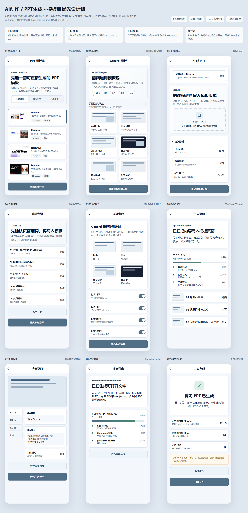

# AI 创作 / PPT 生成前端设计图

## 设计资产

- 设计板 HTML：`docs/designs/ppt-generation-mobile-design.html`
- 设计板截图：`docs/designs/ppt-generation-mobile-design.png`
- 对应实现：`mini_program_app/subpackage_learning/resourceGenerate/AIPresentationFlow.vue`

## 本次设计结论

上一版设计的问题是把“模板”做成了风格选择。用户真正需要的是一套可直接套用的现成 PPT 模板库：每套模板都有缩略图、页面版式、适用场景和可生成结果。PPT 生成不能只让用户选“简约/商务/重点讲解”这类抽象风格，而要让用户先看到实际会被套用的模板包。

新版设计改为“模板库优先”：

- 入口先展示内置 Presenton 模板包。
- 模板详情展示封面、目录、章节、内容、图文、总结等 layout。
- 上传资料前先明确模板和版式覆盖范围。
- 生成时展示内容正在写入哪个 layout。
- 结果页展示使用的模板、PPTX/PDF/预览图状态。

## 产品目标

PPT 生成不是一次性“丢给 AI 等结果”的工具，而是一个基于模板资产的可控内容生产流程。用户需要在关键节点确认模板、内容结构、页面设置、逐页内容和导出结果，避免生成出无法修改、无法导出或不知道失败原因的 PPT。

## 用户流程

1. 模板库入口：用户先选择一套现成模板包。
2. 模板详情：查看该模板的 layout 数量、页面类型和可套用结构。
3. 上传资料：模板已选定后上传 TXT、PDF、Word、PPT 或 Excel。
4. 大纲编辑：确认每一页讲什么，可以新增、删除、调整页面顺序。
5. 模板参数：确认封面、目录、章节页、总结页和内容密度。
6. 逐页生成：展示内容正在写入具体模板 layout。
7. 页面检查：逐页检查标题、要点、图片和版式锁定状态。
8. 渲染导出：展示 Presenton HTML、PDF/预览图、PPTX 转换进度。
9. 结果与恢复：展示 PPTX/PDF/预览图状态，PPTX 失败时保留 PDF。

## 设计原则

- 流程可中断：生成过程要能取消、返回编辑或保留已完成结果。
- 错误可恢复：PPTX 转换失败时不阻断 PDF 和页面预览下载。
- 模型链路透明：PPT 生成复用已测试成功的 AI 文本模型配置，与思维导图、活动图等 AI 创作工具一致。
- 模板资产前置：模板必须以真实缩略图和 layout 结构出现，而不是抽象风格卡片。
- 风格一致：使用浅灰背景、白色表面、低饱和蓝灰强调色，延续当前校园学习页面的克制风格。
- 操作前置确认：先确认大纲与页面设置，再进行最终渲染，减少用户等待后返工。

## 实现对应

- 模板库：现有实现需要补一个模板选择入口，读取 `/api/app/ai/ppt/options` 中的 `templates`。
- 模板详情：现有后端已有模板 `thumbnailUrl`、`layoutCount`，前端还需要展示 layout 类型预览。
- 上传/输入：对应当前 `currentStep === 1`，但新版应在模板选择后进入。
- 大纲编辑：对应当前 `currentStep === 3`。
- 模板与参数：对应当前 `currentStep === 4`，需要强化“模板包和 layout 使用计划”。
- 页面轻编辑：对应当前 `currentStep === 5`。
- 生成进度：对应当前 `currentStep === 6`。
- 结果预览：对应当前 `currentStep === 7`。
- 导出下载：对应当前 `currentStep === 8`。

## 这次补充说明

这版设计图替换了上一版“风格优先”的方案。后续前端实现需要以这份模板库优先设计为准：先让用户选真实模板，再进入资料上传和生成闭环。
