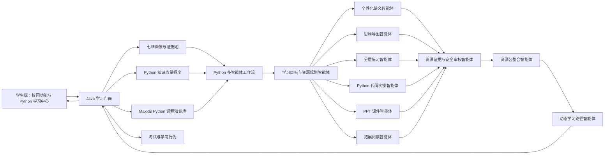

# Python 个性化学习闭环全面补齐设计

## 1. 目标与背景

本设计用于在保留智慧校园现有全部功能的前提下，以现有 MaxKB 中的 Python 课程知识库为教学主线，补齐中国软件杯 A3 赛题要求的完整闭环：

1. 通过自然语言对话构建并持续更新不少于 6 个维度的学生画像。
2. 由多个角色明确、执行可观察的智能体协同生成不少于 5 类个性化学习资源。
3. 将资源、画像、课程知识结构和掌握度整合为可持久化、可动态调整的学习路径。
4. 将答题、资源使用和学习行为回流为画像与知识点掌握度证据，并触发路径重规划。
5. 提供可执行的证据约束、内容安全、生成进度、错误恢复和提交级验证。

本次工作不删除、不隐藏、不降级课表、会议、食堂、地图、论坛、活动、二手等校园功能。Python 学习中心是新增教学主线，不替代原有智慧校园产品结构。

## 2. 设计原则

- **课程事实单一来源**：Python 课程事实以现有 MaxKB 知识库召回结果为准，账号、知识库 ID 和 API Key 只保留在 Java 服务端。
- **Java 管业务状态**：鉴权、用户画像、MaxKB、学习路径、掌握度、考试、资源记录和持久化由 Java 后端负责。
- **Python 管智能体协作**：Python AI 服务负责确定性工作流、专业智能体执行、资源审核、打包和路径建议。
- **协作可证明**：每个智能体必须有明确输入、输出、状态、耗时和上游依赖，不能仅以目录数量表示多智能体。
- **资源真实可用**：页面展示的核心资源必须能生成、预览、下载或进入学习，不允许硬编码预览或仅弹 Toast。
- **证据优先**：Python 课程资源必须关联 MaxKB 来源；没有课程证据的事实性内容不能标记为完成。
- **失败可恢复**：单个资源失败可独立重试，已经成功的资源不得被重复覆盖；资源包状态可恢复查询。
- **兼容现状**：复用现有画像证据、Leader 会话、资源信封、导出、考试和 MaxKB 服务，不进行无关重构。

## 3. 总体架构



不新增 LangGraph 运行时依赖。Python 侧新增一个显式状态模型和确定性 DAG 调度器，使用现有专业智能体运行器与模型绑定配置。并行只发生在相互独立的资源生成节点；检索、规划、审核、整合和路径生成保持顺序依赖。

## 4. 课程绑定与 MaxKB 边界

### 4.1 Python 课程绑定

Python 课程使用稳定课程键 `python`。Java `system_config` 保存以下非前端字段：

- `learning.python.course-title`
- `learning.python.maxkb-account-id`
- `learning.python.maxkb-knowledge-id`
- `learning.python.enabled`

前端只看到课程键、课程名称、章节、知识点和资源，不接触 MaxKB accountId、knowledgeId 或密钥。

### 4.2 学生态召回门面

现有管理员 MaxKB 管理接口继续保留管理员权限。新增学生可调用、服务端固定绑定的召回接口：

`POST /api/app/learning/knowledge/retrieve`

请求：

```json
{
  "courseKey": "python",
  "query": "Python 列表和元组的区别",
  "topNumber": 6,
  "similarity": 0.55
}
```

响应只返回经过字段白名单和长度限制的引用：

```json
{
  "courseKey": "python",
  "references": [
    {
      "evidenceId": "kb_ref_...",
      "documentId": "...",
      "documentName": "Python程序设计-第三章",
      "section": "3.2 列表",
      "content": "...",
      "score": 0.88
    }
  ],
  "cache": {
    "hit": true,
    "ageSeconds": 12
  }
}
```

召回逻辑从现有 `KnowledgeChatServiceImpl` 拆出 `retrieve` 方法，聊天与学习工作流共用同一引用抽取和缓存实现，避免学生端绕过 Java 直接访问 MaxKB。

## 5. 多智能体工作流

### 5.1 工作流状态

Python 新增 `LearningWorkflowState`，至少包含：

- `workflow_id`
- `user_id`
- `course_key`
- `topic`
- `profile_snapshot`
- `mastery_snapshot`
- `references`
- `resource_plan`
- `resource_results`
- `review_results`
- `learning_path`
- `status`
- `errors`
- `started_at`
- `updated_at`

执行中的工作流状态以 `learning:workflow:{workflowId}` 为键保存在现有 Redis，TTL 为 24 小时，用于 SSE 断线恢复和资源单项重试。工作流完成后，最终资源、证据链、导出附件继续写入现有 Leader 会话/消息资源记录，学习路径与掌握度写入本设计定义的三张业务表；不为临时执行状态新增第四套业务表。

### 5.2 执行阶段

1. `profile`：读取 Java 已注入的七维画像和输出偏好。
2. `retrieval`：调用 Java 学生态 MaxKB 召回门面。
3. `planning`：学习目标规划智能体输出本轮目标、难度、先修知识、资源任务和路径约束。
4. `generating`：并行执行六个资源智能体。
5. `reviewing`：资源审核智能体逐项校验证据、事实、安全和格式。
6. `rewriting`：未通过资源最多重写一次，仅重写失败项。
7. `packaging`：整合通过审核的资源并生成资源间引用关系。
8. `pathing`：结合掌握度生成或调整学习路径。
9. `persisting`：Java 持久化资源、路径和状态。
10. `done`：返回资源信封、证据链、路径摘要和推荐理由。

### 5.3 六类资源

| 类型 | 智能体 | 真实产物 | 最低要求 |
| --- | --- | --- | --- |
| 个性化讲义 | `textbook_knowledge_agent` | Markdown、DOCX | 包含目标、讲解、例子、易错点和引用 |
| 思维导图 | `diagram_mind_map_agent` | MMD、Markdown、PNG/SVG | Mermaid 可解析，节点与引用一致 |
| 分层练习 | 现有题型智能体 | 题库 JSON、XLSX、DOCX | 至少两种题型，答案和解析通过 schema |
| Python 代码实操 | 新增 `python_code_lab_agent` | `.py`、实验说明、测试用例、ZIP | 代码可执行，包含输入输出与断言 |
| PPT 课件 | 现有 PPT 智能体链 + 确定性导出器 | `.pptx`、大纲 Markdown | 结构化大纲、布局、审核后生成真实 PPTX |
| 拓展阅读 | 新增 `extension_reading_agent` | Markdown、DOCX | 区分课程来源、先修内容和扩展建议 |

视频继续保留现有 Qwen 视频链路，作为可选第七类资源。视频失败不得阻塞六类核心资源包。

### 5.4 资源包完成条件

- 六类资源中至少五类成功并通过审核。
- 讲义、练习和代码实操为必需资源；任一缺失时资源包不能完成。
- 每个事实性资源至少关联一个 MaxKB `evidenceId`。
- 课程事实不得以 `model_only` 状态通过审核。
- 失败项保留错误码和可重试状态，不删除已成功资源。

## 6. 画像、掌握度与动态学习路径

### 6.1 对话式画像补齐

Python 学习首页读取七维画像完整度。专业/课程背景、学习目标、资源偏好或薄弱点缺失时，每次只提出 2–3 个自然语言问题。回答通过现有画像证据协议进入候选池，前端和 LLM 不直接修改雷达分数。

### 6.2 最小持久化模型

新增三张表：

#### `learning_knowledge_mastery`

- `id`
- `user_id`
- `course_key`
- `knowledge_point_key`
- `knowledge_point_name`
- `score`，范围 0–100
- `confidence`，范围 0–1
- `evidence_count`
- `last_evidence_type`
- `updated_at`

唯一约束：`user_id + course_key + knowledge_point_key`。

#### `learning_path`

- `id`
- `user_id`
- `course_key`
- `version`
- `status`
- `profile_snapshot_json`
- `mastery_snapshot_json`
- `replan_reason`
- `created_at`
- `updated_at`

同一用户同一课程最多一个 `active` 路径。

#### `learning_path_item`

- `id`
- `path_id`
- `sequence_no`
- `knowledge_point_key`
- `title`
- `objective`
- `status`：`locked/ready/in_progress/completed/needs_review`
- `resource_ids_json`
- `recommendation_reason`
- `mastery_before`
- `mastery_target`
- `scheduled_at`
- `completed_at`

### 6.3 答题反馈

现有考试提交逻辑保留。提交后增加学习反馈处理：

1. 将错题映射到题目 `knowledgePoints`。
2. 依据题型、难度、正确性和重复错误计算掌握度证据。
3. 写入现有 `UserProfileEvidence`，更新 `weak_points`、`learning_progress` 和 `ability_performance` 的候选证据。
4. 更新 `learning_knowledge_mastery`。
5. 当掌握度低于节点目标或重复错误时，将节点设为 `needs_review` 并触发路径重规划。
6. 考试提交响应增加 `learningUpdate`，包含掌握度变化、路径变更和下一推荐资源。

## 7. Java API 设计

新增学生端统一前缀：`/api/app/learning`。

| 方法 | 路径 | 用途 |
| --- | --- | --- |
| GET | `/courses/python/home` | Python 首页聚合数据 |
| POST | `/courses/python/profile-answers` | 提交对话画像答案 |
| POST | `/knowledge/retrieve` | 服务端绑定的 MaxKB 召回 |
| POST | `/resources/generate/stream` | 启动资源包并返回 SSE |
| GET | `/workflows/{workflowId}` | 恢复查询生成状态 |
| POST | `/workflows/{workflowId}/resources/{type}/retry` | 重试单类资源 |
| GET | `/courses/python/path` | 获取当前学习路径 |
| POST | `/courses/python/path/replan` | 显式触发重规划 |
| POST | `/path-items/{itemId}/start` | 开始节点 |
| POST | `/path-items/{itemId}/complete` | 完成节点 |
| GET | `/courses/python/recommendations` | 获取精准推荐 |
| POST | `/recommendations/{itemId}/interactions` | 记录打开、忽略或完成 |

考试提交保持现有路径，响应体增加 `learningUpdate`，不新建重复交卷接口。

## 8. SSE 进度协议

`POST /api/app/learning/resources/generate/stream` 使用以下事件：

- `accepted`
- `profile`
- `retrieval`
- `planning`
- `agent_start`
- `agent_done`
- `agent_failed`
- `review_start`
- `review_result`
- `exporting`
- `pathing`
- `persisting`
- `done`
- `error`

每个事件包含 `workflowId`、`stage`、`progress`、`agentName`、`resourceType`、`message` 和可选的可恢复错误信息。进度来自真实阶段完成情况，不得在完整回答产生后通过定时切块模拟。

## 9. 学生端设计

### 9.1 Python 学习中心

新增 `AppFrontend/subpackage_learning/pythonHome/pythonHome.vue`，展示：

- 课程标题与当前画像完整度
- 2–3 个自然语言画像补问
- 今日学习任务
- 当前路径摘要
- 精准推荐
- 最近生成资源
- 一键生成个性化资源包

首页增加“Python 个性化学习”入口，但不替换任何现有校园入口。

### 9.2 资源生成页

新增 `AppFrontend/subpackage_learning/resourceGenerate/resourceGenerate.vue`：

- 展示 MaxKB 召回、规划、六个资源智能体、审核、导出和路径生成进度。
- 复用现有 `resources + evidenceChain` 和受控下载能力。
- 每类资源提供预览、下载、重新生成或开始学习操作。
- PPT 卡必须下载真实 `.pptx`，不得使用硬编码预览。

### 9.3 学习路径与推荐

新增：

- `subpackage_learning/learningPath/learningPath.vue`
- `subpackage_learning/recommendations/recommendations.vue`

学习路径状态完全以后端为准。推荐卡必须展示知识点、推荐理由、证据摘要和明确操作，不使用纯文本推送表替代真实资源。

### 9.4 现有页面修复

- `examGenerate.vue` 按标准响应信封读取 `res.data.answer`。
- AI 对话使用统一 Markdown/Mermaid 渲染。
- `BASE_URL` 改为环境配置，不再固定 localhost。
- AI 创作大厅核心资源入口跳转真实生成页。
- 其余工具继续保留，统一进入带预填意图的 Leader 对话或展示真实能力状态，不允许静默无响应或伪造完成。

## 10. 内容安全、证据和隐私

### 10.1 课程事实审核

资源审核智能体和服务端确定性检查共同执行：

- 资源引用的 `evidenceId` 必须存在于本次召回集合。
- 资源包中的引用关系必须通过现有证据链完整性校验。
- 对课程定义、语法规则、示例结论和答案依据进行引用覆盖检查。
- 资料不足时输出缺失说明，不允许用模型常识填充为已引用事实。
- 审核失败资源最多重写一次，第二次失败保持失败状态。

### 10.2 内容安全

- 输入执行长度、文件类型、URL 和提示注入模式检查。
- 输出执行敏感违规内容分类和代码危险操作检查。
- Python 代码实验默认禁止文件系统破坏、外部网络访问、子进程和凭据读取。
- 资源下载继续使用会话所有者校验和 capability 约束。

### 10.3 凭据与个人信息

- `application.yml` 和种子 SQL 中不保留真实云密钥、JWT 固定密钥或个人凭据。
- 所有秘密改为环境变量，并在 `.env.example` 中仅保留占位名称。
- 提交前完成密钥轮换记录、个人数据映射和 secret/PII 扫描。

## 11. 错误处理与恢复

- 工作流和每个资源节点的执行状态保存在 Redis 24 小时，最终资源、证据与路径写入数据库。
- 模型、MaxKB 或导出失败使用稳定错误码，前端显示可恢复动作。
- 资源单项失败不会清除其他成功资源。
- 同一 `workflowId + resourceType` 重试具有幂等性。
- 会话断开后通过 `GET /workflows/{workflowId}` 恢复进度和结果。
- 保留最近一次完整成功资源包，临时故障时允许继续学习，但明确标注生成时间和版本。
- Java 调用 Python 和 MaxKB 使用有限超时、一次退避重试和熔断恢复时间，不允许永久禁用工具。

## 12. 部署与提交物

完整提交环境包含：

- MySQL
- Redis
- Java AppBackend
- Python AI Server
- AppWeb
- 外部 MaxKB 连接配置

必须提供：

- 一键 Compose 与健康检查
- Python 课程知识库清单、来源清单、MaxKB 导出或等价恢复包
- 导入与绑定说明
- 开源组件与许可证清单
- AI Coding 使用说明
- 测试矩阵、事实准确率报告和性能报告
- 最终 PPT、PDF、7 分钟内视频、字幕、脚本和冻结样例包

## 13. 测试设计

### 13.1 Python

- 修复当前全部失败测试。
- 增加 DAG 顺序、并行资源、单项重试、审核拒绝、资源包门槛和 SSE 事件测试。
- 增加代码实操导出与 PPTX 导出测试。
- 使用假的 Java 召回服务验证引用传递，不依赖真实 MaxKB 才能跑单元测试。

### 13.2 Java

- 增加学生态 MaxKB 召回鉴权与字段过滤测试。
- 增加三张学习表的服务测试。
- 增加考试提交到掌握度、画像证据和路径重规划的闭环测试。
- 增加 Python 工作流代理、SSE 转发、断线恢复和幂等重试测试。

### 13.3 AppFrontend

- 增加 Python 首页聚合数据、画像补问、生成进度、资源卡、路径状态和推荐互动测试。
- 增加试卷响应信封回归测试。
- 增加断线恢复、失败重试和环境 BASE_URL 测试。

### 13.4 提交级评测

- 至少 30 条 Python 课程金标问题，包含可回答、资料不足和易混淆问题。
- 统计召回命中率、引用覆盖率、事实正确率和拒答正确率。
- 对主工作流执行至少 5 并发、50 次请求的稳定性测试。
- 在干净环境执行一键启动、知识库导入、登录、生成资源包、答题和重规划冒烟。

## 14. 48 小时执行节奏

### 0–4 小时：安全与基线门禁

- 轮换并移除仓库内凭据和个人信息。
- 冻结 Python 课程绑定、演示知识点、模型和测试数据。
- 修复 Python 当前失败测试和前端 lint 阻断项。

### 4–16 小时：核心后端与 AI

- 学生态 MaxKB 召回。
- 学习数据模型和 API。
- 多智能体 DAG、六类资源、审核、打包和 SSE。

### 4–14 小时：学生端主线

- Python 学习中心。
- 资源生成页、学习路径页和推荐页。
- 现有 AI 创作入口和响应信封修复。

### 12–24 小时：学习评估闭环

- 考试知识点归因。
- 掌握度更新、画像证据和路径重规划。
- 真实 PPTX 与代码实操导出。

### 24–32 小时：联调与质量门禁

- 全量测试、构建、lint 和主链路冒烟。
- Compose 纳入 Python AI 服务。
- 干净环境复现。

### 24–40 小时：文档与评测

- 开源、AI Coding、安全、部署和知识库文档。
- 事实评测、性能评测和测试报告。
- 冻结真实输出和截图。

### 32–46 小时：答辩材料

- 10–12 页 PPT/PDF。
- 6 分 40 秒到 6 分 55 秒演示视频、字幕和脚本。

### 46–48 小时：发布审计

- 新目录复现。
- secret、PII、license、测试、链接和视频时长复扫。
- 生成提交清单和校验和。

## 15. 验收标准

设计完成后的系统必须满足：

1. 现有校园功能入口和主要回归测试保持可用。
2. 学生可通过自然语言补齐画像，系统展示不少于 7 个画像维度和证据状态。
3. Python 课程请求实际调用服务端绑定的 MaxKB，并展示可追溯来源。
4. 一次工作流能观察到规划、至少 5 个资源智能体、审核、整合和路径智能体的真实执行状态。
5. 至少 5 类资源生成成功，其中讲义、练习和代码实操必需；产物可以预览或下载。
6. PPT 入口产生真实 `.pptx`，思维导图产生真实源码或图片，代码实操产生可执行 `.py` 和测试。
7. 学习路径持久化，节点状态、推荐理由和资源关联可查询。
8. 答题后掌握度、画像证据和学习路径至少有一项可验证变化，并展示调整原因。
9. 课程事实资源不以 `model_only` 状态通过审核，引用关系通过完整性检查。
10. 生成进度来自真实阶段，断线后可恢复，单项失败可重试。
11. 仓库不含有效秘密或未授权个人凭据，开源和 AI Coding 使用有显著说明。
12. Python、Java、AppFrontend、AppWeb 的质量门禁结果均可复现；已知失败必须修复或从提交门禁中明确阻断。
13. 完整提交环境可按文档启动并完成“登录—Python 学习—资源包—答题—路径调整”演示。
14. 最终视频不超过 7 分钟，使用同一冻结代码、知识库版本和样例输出。

## 16. 明确不做的事项

- 不删除、不隐藏、不封堵现有校园功能。
- 不把 MaxKB 密钥或内部 ID 暴露给学生端。
- 不用硬编码资源、截图或静态 JSON 冒充实时生成结果。
- 不新增第二套画像系统、第二套考试系统或第二套资源信封。
- 不为了名称使用 LangGraph；协作能力以真实 DAG 状态和数据依赖证明。
- 不要求视频生成成功才能完成核心资源包。
- 不在本轮对无关校园模块进行架构重写。
